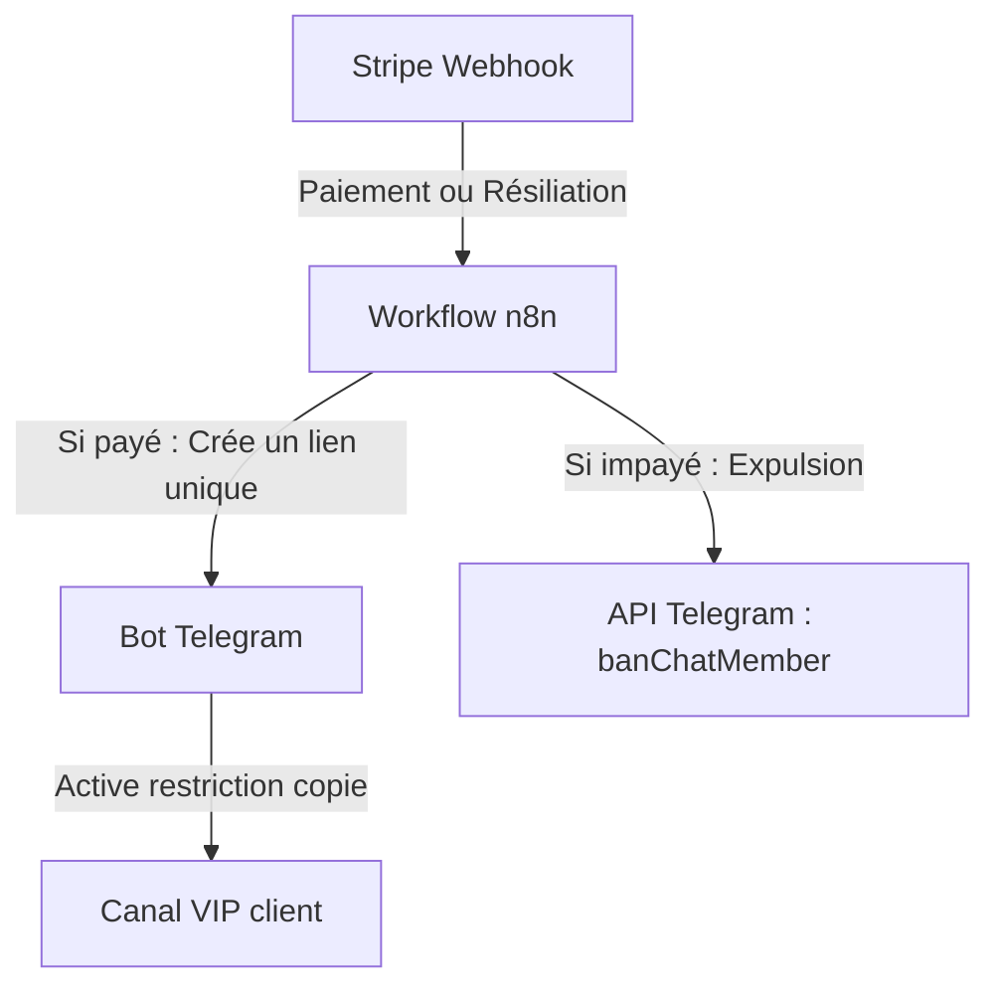

# Guide de Configuration n8n — Le Gardien VIP

Ce guide explique comment configurer votre VPS et votre instance n8n pour gérer automatiquement les paiements Stripe et la sécurité active de votre canal Telegram.

---

## 🛠️ Architecture Globale

---

## 1. Ce que n8n va gérer automatiquement

1. **À l'achat (Stripe Checkout Succeeded) :**
   - Génération d'un lien d'invitation Telegram unique et à usage unique (limite = 1 membre).
   - Envoi du lien au client ou enregistrement dans votre base de données.
2. **À l'expiration/impayé (Stripe Subscription Deleted / Invoice Payment Failed) :**
   - Récupération de l'identifiant Telegram du membre associé à cet abonnement.
   - Appel de la méthode API Telegram `banChatMember` pour exclure instantanément l'utilisateur du canal VIP.
   - Appel immédiat de `unbanChatMember` pour que l'utilisateur puisse se réabonner plus tard s'il le souhaite.

---

## 2. ⚠️ Clarification Technique importante : `has_protected_content`

> [!IMPORTANT]
> **Limitations de l'API Telegram :**
> L'API officielle des bots Telegram **ne permet pas** à un bot de modifier directement les paramètres globaux d'un canal (comme activer le bouton "Restreindre le contenu"). Cette action doit être faite **manuellement** par le propriétaire du canal (en 2 clics).
>
> **Notre solution automatisée dans n8n :**
> 1. Notre bot effectue un appel `getChat` sur le canal du client pour vérifier si `has_protected_content` est bien à `true`.
> 2. Si le paramètre est à `false` (non sécurisé), le bot envoie immédiatement une alerte critique au propriétaire du canal avec un tutoriel pour l'activer en 2 clics.
> 3. Pour tous les messages envoyés directement par le bot (signaux automatiques), n8n ajoute le paramètre `protect_content = true` pour s'assurer que ces messages spécifiques ne puissent jamais être transférés.

---

## 3. Importation du Workflow dans n8n (1 clic)

Nous avons créé le fichier de workflow prêt à l'importation :
👉 [n8n_workflow.json](file:///Users/Emixam/Documents/Antigravity/Grpes_Telegram_Saas/tma/n8n_workflow.json)

### Procédure d'importation :
1. Ouvrez votre instance n8n sur votre VPS.
2. Créez un nouveau workflow.
3. Cliquez sur le menu en haut à droite (trois petits points) et choisissez **Import from File**.
4. Sélectionnez le fichier `n8n_workflow.json`.
5. Configurez vos informations d'identification (Credentials) :
   - **Stripe API** (clé secrète Stripe).
   - **Telegram Receiver** (Token de votre Bot Telegram créé via BotFather).

---

## 4. Configuration des Webhooks Stripe

Dans votre tableau de bord Stripe (développeurs > Webhooks), ajoutez l'URL fournie par le nœud **Webhook Stripe** de n8n (le lien de production `https://votre-n8n.com/webhook/...`).

Abonnez-vous aux événements suivants :
- `checkout.session.completed` (lorsqu'un utilisateur achète l'accès).
- `customer.subscription.deleted` (lorsqu'un abonnement est annulé).
- `invoice.payment_failed` (lorsqu'un paiement échoue).
